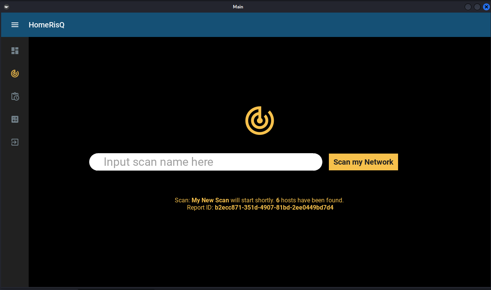

# Measuring Home Network Security using Aggregated Risk Oriented Modeling
Authors: `Robie A. Carlos` and `Joseph Anthony C. Hermocilla`

With the number of network vulnerabilities and exploits being discovered at a rate higher than ever before, it has become important to analyze even the simple home networks used by regular households. This study implements a desktop application called HomeRisQ which measures a home network's security using Greenbone Vulnerability Scanner and a risk-oriented model. It shows the risk score of all the vulnerabilities found in all hosts discovered inside the network and presents a value between 0 to 100 (lower is better) to show the security state of the network. It all provides other basic information regarding each vulnerability to facilitate remediation. 

Keywords: Network Security, Risk Aggregation, CVSS, Home Network, CVE

## Screenhots:

1. Scan Screen

2. History Screen

3. Dashboard

4. Solutions

5. Calculator

To setup the project, kindly follow the instructions in `setup.md`
